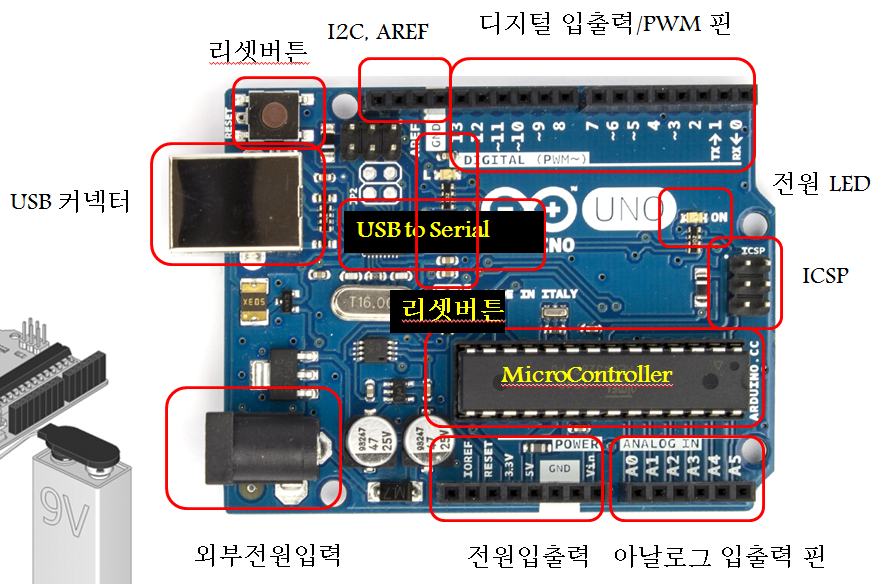
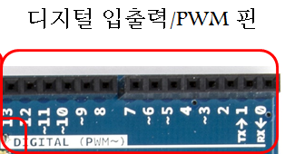
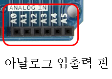
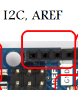
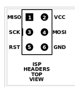
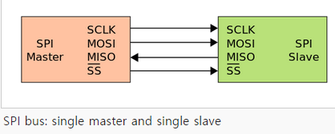
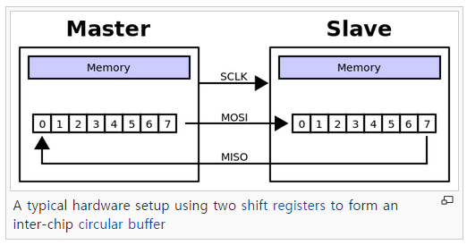
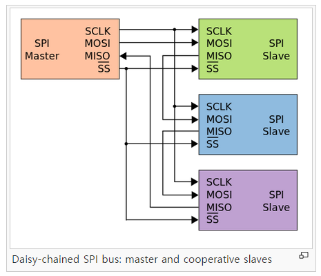

2015-06-12
----------

### 진행 내용
* 아두이노 다운로드
* 블링크 예제 실습

```
// the setup function runs once when you press reset or power the board
void setup() {
  // initialize digital pin 13 as an output.
  pinMode(13, OUTPUT);
}

// the loop function runs over and over again forever
void loop() {
  digitalWrite(13, HIGH);   // turn the LED on (HIGH is the voltage level)
  delay(1000);              // wait for a second
  digitalWrite(13, LOW);    // turn the LED off by making the voltage LOW
  delay(1000);              // wait for a second
}
```




* Processor - MCU
ATmega328를 사용하며, 8bit AVR이다., 아래는 주요 Key Parameters들
| Parameter                   | Value     |
|-----------------------------|---------- |
| Flash (Kbytes):             | 32 Kbytes |
| Pin Count:                  | 32        |
| Max. Operating Freq. (MHz): | 20 MHz    |
| **CPU:**                    | **8-bit AVR**|
| # of Touch Channels:        | 16        |
| Hardware QTouch Acquisition:| No        |
| Max I/O Pins:               | 23        |
| Ext Interrupts:             | 24        |
| USB Speed:                  | No        |
| USB Interface:              | No        |

* SMD Type(Surface Mounted Device)
Surface Mounted Device, used to describe electronic devices (such as resistors, capacitors, transistors, LEDs, integrated circuits, etc.) mounted or soldered directly on the surface of printed circuit boards, see Surface-mount technology.
> https://en.wikipedia.org/wiki/Surface-mount_technology
> 그래서, 아두이노는 SMD Type Device이다.

* PWM Pins(Pulse With Modulation) - 6개
모터 속도나 전구의 밝기 등을 조절할 때, 반드시 PWM Pin을 사용해서 변수값을 설정해야한다.
0 ~ 255 사이의 값(1byte)으로 설정 가능.
아두이노에서는, 물결 모양의 ~ 3,~5, ~6, ~9, ~10, ~11


* Analog Input - 6개
A0 ~ A5, 보통 센서들이 연결됨.


* I2C(I Square C)
    * 우리가 가지고 있는 브루노 보드는 아래와 같이, SCL, SDA로 표시하고 있다.
    * SCL(Serial Clock Line) - Clock이 들어온다. 이것을 이용해서 타이밍 조절
    * SDA(Serial Data Line) - Data가 들어오고 나가는 통로
Arnuino: ,  Bruno: 

* AREF - Analog Reference
Configures the reference voltage used for analog input (i.e. the value used as the top of the input range). The options are:
DEFAULT: the default analog reference of 5 volts (on 5V Arduino boards) or 3.3 volts (on 3.3V Arduino boards)
INTERNAL: an built-in reference, equal to 1.1 volts on the ATmega168 or ATmega328 and 2.56 volts on the ATmega8 (not available on the Arduino Mega)
INTERNAL1V1: a built-in 1.1V reference (Arduino Mega only)
INTERNAL2V56: a built-in 2.56V reference (Arduino Mega only)
EXTERNAL: the voltage applied to the AREF pin (0 to 5V only) is used as the reference.
> http://www.arduino.cc/en/Reference/AnalogReference?from=Reference.AREF

* ICSP(In-Circuit Serial Programming (ICSP))
    * MISO : Master In Slave Out
    * VCC : 전원
    * SCK : Clock
    * MOSI : Master Out Slave in
    * RST : Reset
    * GND : Ground
> https://en.wikipedia.org/wiki/In-system_programming
, 
> 기본적으로, Master, Slave 관계를 가지며, 한쪽이 MOSI로 Data를 전달하면, Slave는 MISO로 Data를 전달 받고 회신한다. 그러면, MOSI로 Data가 수신될 것이다.
> 위키의 자료를 참고하면 보통 JTAG 구현 시 주로 이용하는 것으로 보인다.

* SPI(Serial Peripheral Interface Bus)
Serial로 Data 송수신 시 사용한다.
기본적으로 Master, Slave 관계를 가진다. 이때, SS(Slave Select)를 통해서 여러개의 Slave가 존재 할 수 있다.
Data 송수신 시, Master -> Slave로 보낼때, Master로 쓰레기값이 존재한다.
> https://en.wikipedia.org/wiki/Serial_Peripheral_Interface_Bus
> http://www.arduino.cc/en/Reference/SPI
> [What is the ICSP?](http://forum.arduino.cc/index.php?topic=126979.0)

> 그렇다면? ICSP와 SPI의 차이점은? ICSP의 경우는 Slave가 하나일 것이다.
>> 그래서, SPI를 쓰려면, 디지털 핀을 이용해서 확장해서 사용 가능할 것이다.
>> 그리고 아두이노는 이와 관련한 라이브러리를 지원한다.



, 
> Slave Select는 첫번째와 같이 형태가 전형적이지만, 후자와 같이 하나의핀으로 컨트롤하는 것을 현장에서는 선호한다.

* 파워 입출력
   * VIN : 전원을 외부로 공급받을 때 사용
   * 3V3, 5V : 외부 장치에 전원 공급하는 역할
   * GND : 전원 연결 후 기본으로 제공해야 한다.
   * RESET : Stronger RESET circuit(Printed circuit board).
   * IOREF : 쉴드를 연결했을 때, 전원을 보드가 공급해주겠다. IOREF that allow the shields to adapt to the voltage provided from the board
   * [IOREF? (Read 9481 times)](http://forum.arduino.cc/index.php?topic=122743.0)

* Serial print()
Format은 한정되어 있으며, 우리가 흔히 아는 Printf와는 차이가 있다.

### Issue
* Arduino는 몇비트입니까?
> 8bit 입니다. Atmega328이 8비트이기 때문에.

### Trouble Shooting

* 드라이버 설치
    * 아두이노 설치 폴더에 드라이버가 있으며, 강제로 잡아 줄 수 있다.
    * ex) c:\Program Files (x86)\Arduino\drivers\
* 보드 / 포트 설정을 먼저 확인 후 진행

* USB와 ICSP 2개로 존재한다.
> 각각에 대해서 프로토콜이 다른 것으로 이해하도록 하자.

### Action Item


### External Links
* 코딩클럽 왕초보 아두이노따라잡기 1탄 - http://www.slideshare.net/Muzikino/1-46771984
* Arduino mother site : http://www.arduino.cc/
* AVR : https://en.wikipedia.org/wiki/Atmel_AVR
* S4A(Scratch for Arduino) - GUI 개발툴 : http://s4a.cat/
* ATmega328 : http://www.atmel.com/devices/atmega328.aspx