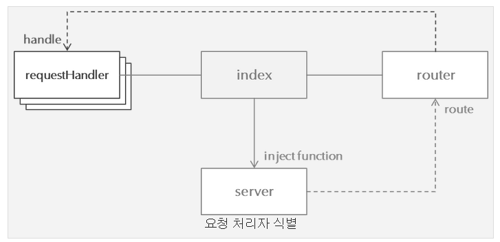

2015-08-07
==========

Update History
--------------

- 2015-08-07 / 초안 작성

진행 내용
--------

* Node.js 설치
* Node.js IDE 구성
* HelloWorld 작성

### 개발 환경 구성

* Node.js 설치 : 공식 홈페이지를 참고해서 진행했다. 옵션 체크하면, 환경변수까지 잡아준다.
* Node.js Eclipse-IDE 구성 : http://forum.falinux.com/zbxe/index.php?document_srl=780872&mid=lecture_tip 를 참고
   * Market에서 Nodeclipse를 선택해서 설치하면 된다. 그다지 어려운 것은 없다.
   * 주의점은 실행시, Packge Explorer가 아니라, Text Editor에서 오른쪽 마우스로 실행할 것.

### Node.js로 Hello World 시작하기.

http://www.nextree.co.kr/p8574/ 를 참고해서, Sample 프로그램을 작성해 보았다.
git에 notes/2015-08/HelloNodejs를 참고하면 된다.
이 예제에는 모듈 작성, 자바의 익명객체를 이용한 문법과 유사한 형태의 코드를 이용해서 handle하는 코드까지 있다.

**Architecture**


아래는 관련 코드들이다.
```java
<index.js>
/**
 * New node file
 */
var server = require('./server');	// 모듈 로딩, 쉽게 파일 혹은 class라고 개념상 이해, import + a 개념
var router = require('./router');
var requestHandlers = require('./requestHandlers');

server.start(router.route, requestHandlers.handle);
//

<server.js>
/**
 * New node file
 */
var http = require('http');
var url = require('url');

function start(route, handle) {
	function onRequest(req, res) {
		var pathname = url.parse(req.url).pathname;
		console.log('request received. ' + pathname);
		
		route(handle, pathname, res);	// injection function call
	}
	
	http.createServer(onRequest).listen(8888);
	
	console.log('Server has started');
}

exports.start = start;
//

<router.js>
/**
 * New node file
 */
function route(handle, pathname, res) {
    console.log('about to route a request for ' + pathname);
    if (typeof handle[pathname] === 'function') {
        handle[pathname](res);
    } else {
        console.log('no request handler found for ' + pathname);
        res.writeHead(404, {'Content-Type' : 'text/plain'});
        res.write('404 Not Founc');
        res.end();
    }
}

exports.route = route;

<requestHandlers.js>
/**
 * New node file
 */
function view(response) {
    console.log('request handler called --> view');
    response.writeHead(200, {'Content-Type' : 'text/plain'});
    response.write("Hello View");
    response.end();
}

function create(response) {
    console.log('request handler called --> create');
    response.writeHead(200, {'Content-Type' : 'text/plain'});
    response.write('Hello Create');
    response.end();
}

var handle = {}; // javascript object has key:value pair.
handle['/'] = view;
handle['/view'] = view;
handle['/create'] = create;

exports.handle = handle;

```


External Links
----------------
* [eclipse node.js 설치](http://forum.falinux.com/zbxe/index.php?document_srl=780872&mid=lecture_tip)
* http://www.slideshare.net/rippertnt/iot-make-with-open-hw-nodejs-2nd?related=3
* [Node.js로 Hello World 시작](http://www.nextree.co.kr/p8574/)
* [Express를 이용한 이클립스 실행 및 참고 문서들](http://bit.ly/1EoIZBw)
    - Node.js 문서의 한글 번역본 http://nodejs.sideeffect.kr/docs/v0.10.18/api/
    - Express 문서의 한글 번역본 http://firejune.io/express/
    - Express 튜토리얼 https://github.com/visionmedia/express
    - Runnable - Node.js  http://runnable.com/Node.js , 여기만 잘 참고해도 코딩은 복사-붙여넣기가 된다.
    - Nodeqa - http://nodeqa.com/ - 우리나라 사이트인데 예제까지 상당히 잘 나와있다. 이클립스에서 express 프로젝트 생성시 자동으로 생성되는 코드를 실행해 봤다.